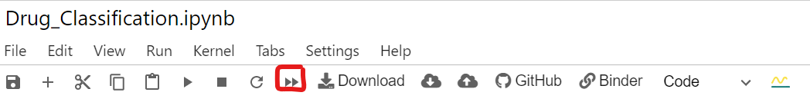
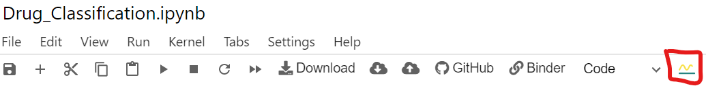
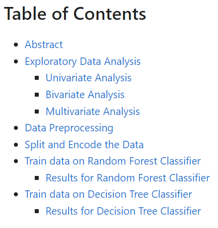
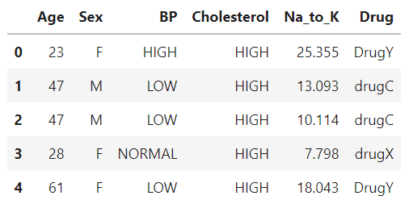
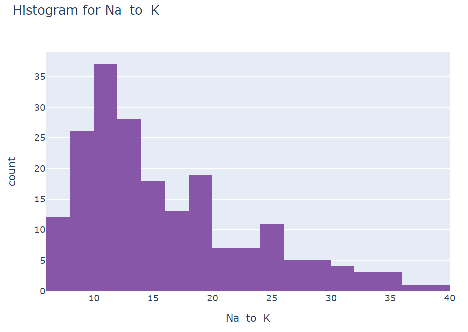
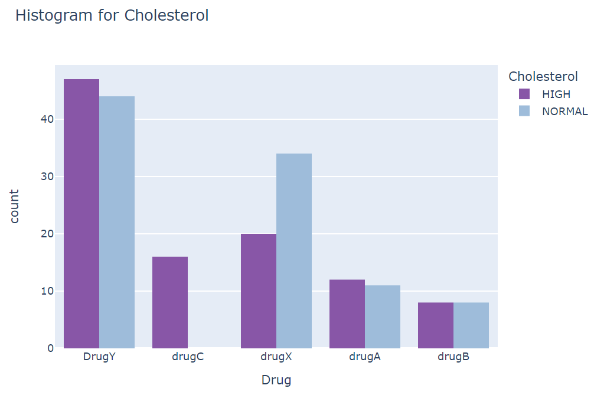
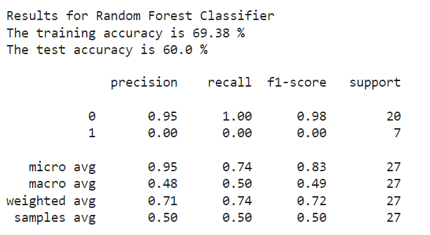
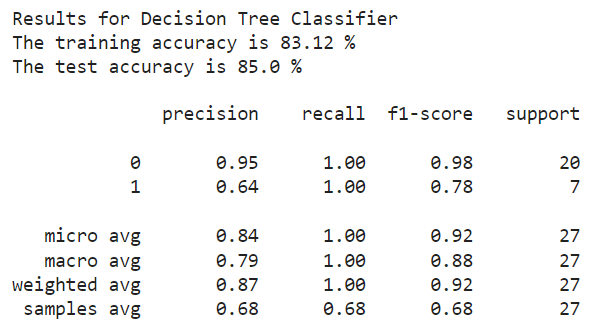

# Drug Classification

This analysis will help predict the best drug to use for a particular patient, based on medical data from 200 patients, by classifying the patient to the drug profile.

## Deployment

The best way to deploy this project is through the Binder link above. The link will open 
directly into the Notebook.

After the notebook loads, run the notebook by clicking the "Restart and run all" 
button.

### No code
This project features a dashboard with no code that can be viewed with Voila.
To see the Voila dashboard with no code click the "Voila" button.

## Contents

Table of contents:

Head:

Histogram of Na_to_K

Histogram of Drug

Results Random Forest Classifier:

Results Decision Tree Classifier:

